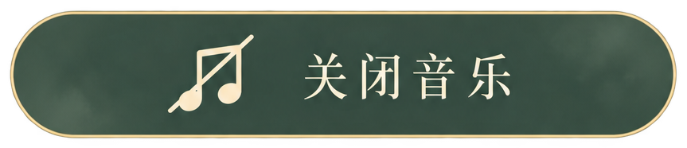

# 南风不回信 · 简洁功能键

14 张独立透明背景 PNG，统一为深绿胶囊、细香槟金边、米白图标与单行宋体文案。包含 12 个温情文案按钮，以及适合首页的「关闭音乐 / 开启音乐」两枚直白文案版本。

## 文件

- `assets/nanfeng/buttons/`：14 枚独立 PNG。
- `assets/nanfeng/buttons.json`：文件名、中文文案、功能对应与实际尺寸。
- `reference/`：两张原始素材表。

| 文件名 | 按钮文案 | 功能 |
| --- | --- | --- |
| `music-off-warm.png` | 让风轻轻说 | 关闭音乐 |
| `music-on-warm.png` | 把风唱给你 | 开启音乐 |
| `skip-animation.png` | 偷偷快进一下 | 跳过动画 |
| `go-back.png` | 回头瞧一眼 | 返回上一页 |
| `pause.png` | 歇会儿，等你 | 暂停游戏 |
| `resume.png` | 走吧，我陪你 | 继续冒险 |
| `restart.png` | 再陪你走一遍 | 重新开始 |
| `home.png` | 回小窝歇歇 | 返回首页 |
| `help.png` | 冒险小纸条 | 操作说明 |
| `confirm-exit.png` | 约好，下次见 | 确认离开 |
| `cancel-exit.png` | 那就，再陪一会儿 | 留在这里 |
| `enter-game.png` | 走啦，鱼鱼等着呢 | 进入游戏 |
| `music-off.png` | 关闭音乐 | 关闭音乐 |
| `music-on.png` | 开启音乐 | 开启音乐 |

## 接入

将 assets 合并进静态站点发布目录；Vite / Next.js 项目可以放在 public/assets 下。引用 URL 不包含 public。

```html
<button type="button" aria-label="关闭音乐" class="image-button">
  
</button>
```

```css
.image-button { padding: 0; border: 0; background: none; cursor: pointer; }
.image-button img { display: block; height: 56px; width: auto; }
.image-button:focus-visible { outline: 2px solid #f4ead0; outline-offset: 4px; border-radius: 999px; }
```

路径相对页面解析；有嵌套路由时使用项目配置的资源基路径。所有按钮保持自身长宽比，不要强行拉伸。渲染时按相同高度缩放，可保持两批素材一致的视觉尺寸。悬停、按下、点击、音乐开关等交互需由代码实现。

图片包含透明通道；按钮内部为接近不透明的深绿底，外部透明。图标与文字已经合并，未附字体文件、独立矢量图层或游戏逻辑。
